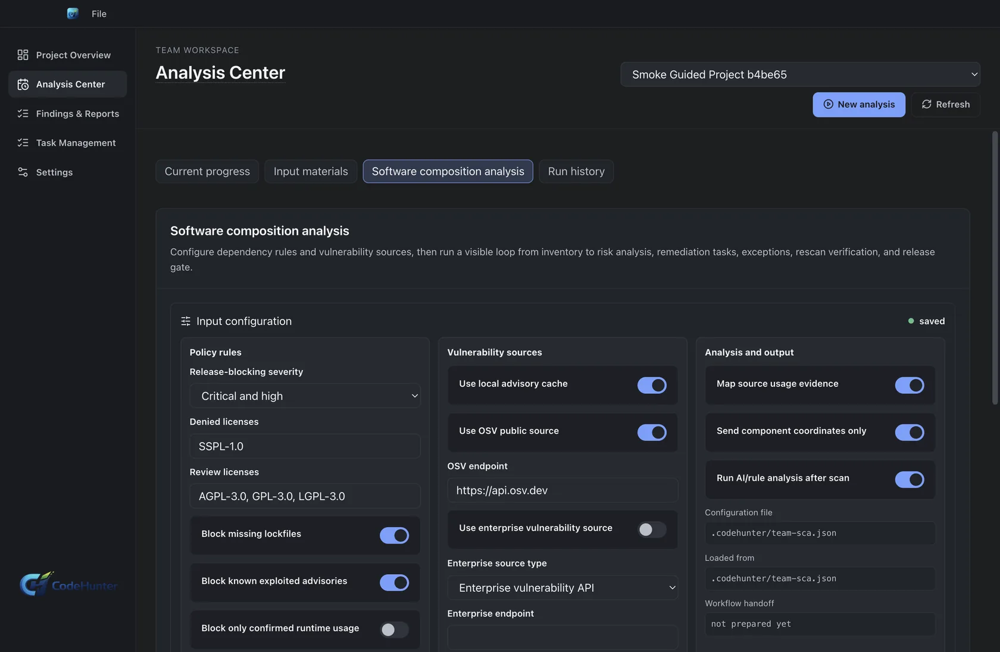
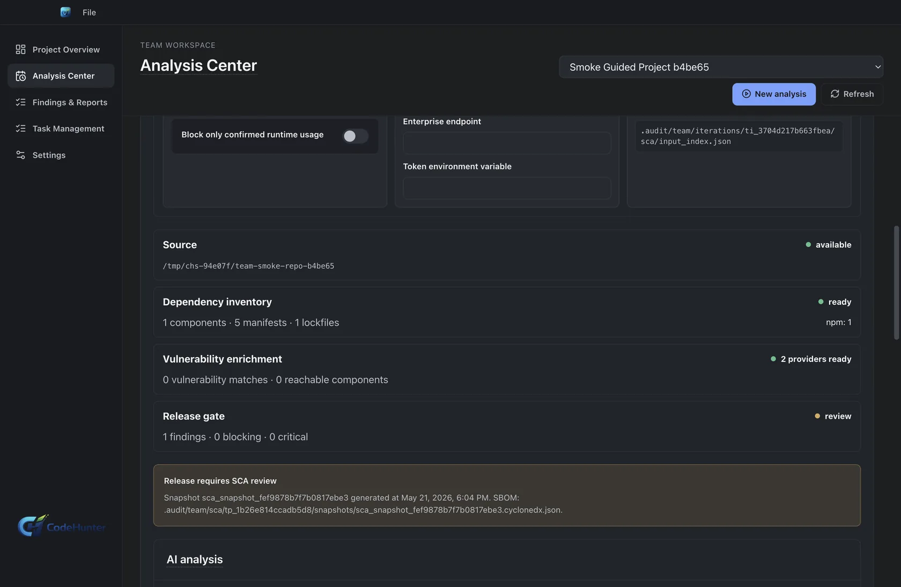
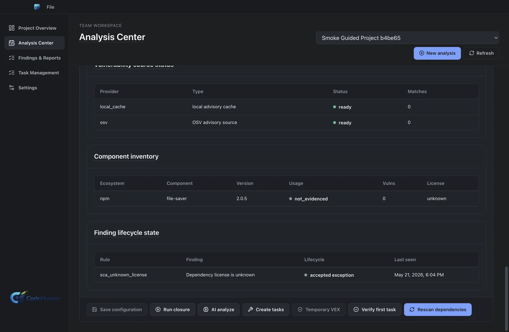
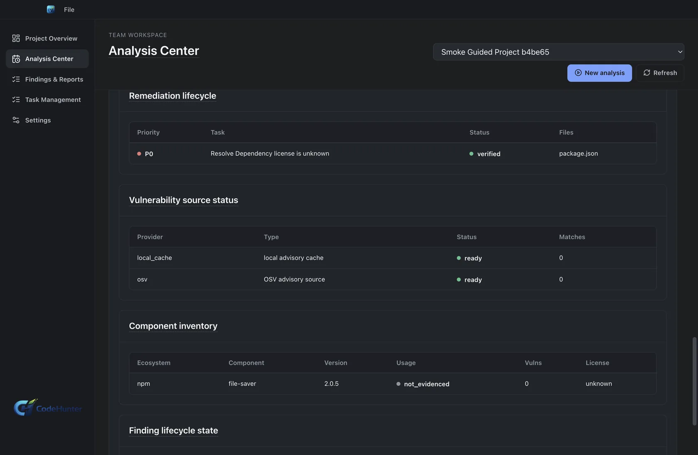

# SCA Release Governance

Code Hunter Team treats SCA as a release-governance workflow, not just a dependency inventory. The product links dependency evidence, policy decisions, exception rationale, remediation tasks, and release readiness.

## Outcome

By the end of the SCA workflow you should have:

- A project-level SCA policy.
- A dependency evidence snapshot.
- Blocking or non-blocking SCA findings.
- Optional VEX or exception decisions.
- Remediation and verification records.
- A release gate decision.

## Step 1: Confirm Project And Source

1. Select the Team project.
2. Confirm the code source.
3. Confirm branch, commit, or baseline.
4. Confirm lockfiles, manifests, or package metadata are in scope.

The most common SCA mistake is scanning the wrong source. Confirm the path or ref before trusting the result.

## Step 2: Configure SCA Policy

1. Open SCA configuration.
2. Select data sources.
3. Set severity and exploitability thresholds.
4. Choose whether a finding can block release.
5. Define exception rules and owner approval requirements.
6. Save the policy.

## Step 3: Run SCA Closure

1. Start the SCA run.
2. Wait for dependency and vulnerability enrichment.
3. Open the SCA finding set.
4. Confirm component, package manager, version, advisory, severity, and source path.
5. Confirm whether the finding is release-blocking.

## Step 4: Review The Release Gate

The release gate should explain:

- Which dependencies are blocking.
- Which policy caused the block.
- Whether an exception exists.
- Whether remediation is required.
- Whether the evidence is sufficient for release.

## Step 5: Apply VEX Or Exception Only When Defensible

Use VEX or temporary exception only when the team can explain why the vulnerable component is not exploitable or why risk is temporarily accepted.

1. Open the finding.
2. Add exception rationale.
3. Set owner and expiration.
4. Attach supporting evidence.
5. Re-run or refresh release readiness.

Do not use VEX as a way to hide unresolved work. It must remain visible in release evidence.

## Step 6: Remediate And Verify

1. Create a remediation task.
2. Assign an owner.
3. Update dependency, remove package, change usage, or isolate the vulnerable path.
4. Link PR/MR and CI evidence.
5. Run fix verification.
6. Confirm the SCA finding is verified fixed or accepted with explicit rationale.

## Done Criteria

SCA release governance is complete only when:

- The scanned source is the intended source.
- Blocking findings have owner decisions.
- Exceptions have rationale, owner, and expiration.
- Remediation has verification evidence.
- Release readiness reflects the SCA policy state.

