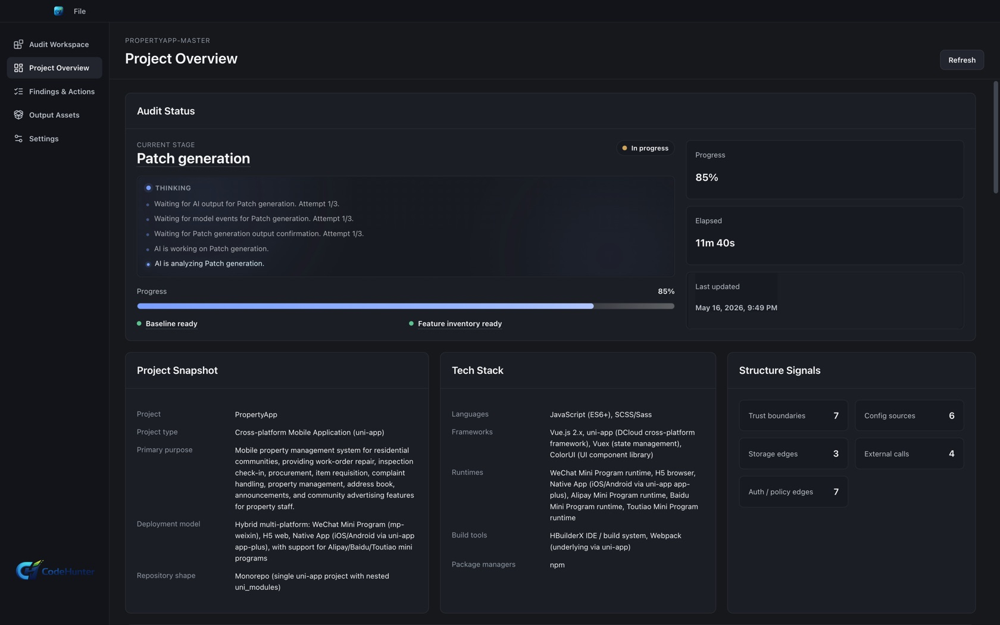
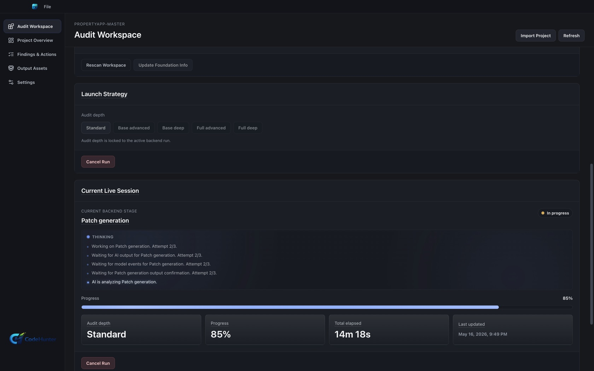
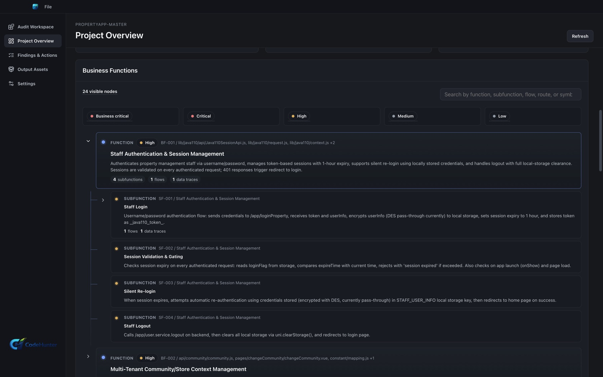
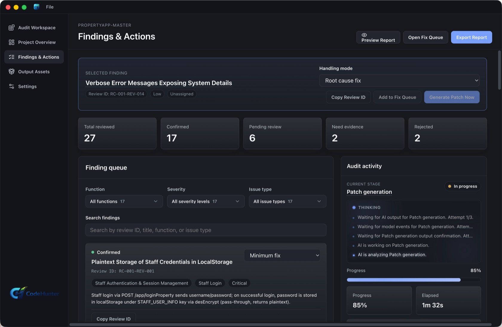
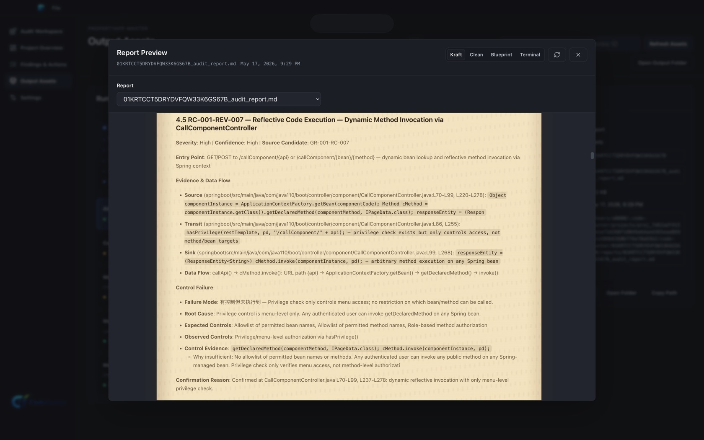
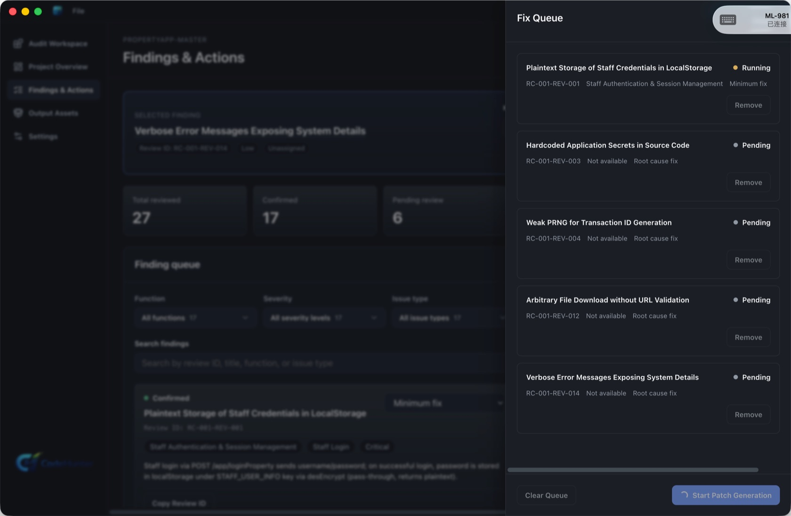

# Code Hunter Personal Usage Tutorial

Use this tutorial when one person owns the review from local project setup through reviewed findings, report output, and scoped fix packages.

## Before You Start

You need:

- Code Hunter Personal installed on your desktop.
- A valid Personal license or activation details.
- Access to the local project folder you want to review.
- A configured AI provider/model in Code Hunter Settings.

## 1. Install And Activate Personal

1. Open Code Hunter Personal.
2. Go to the activation screen.
3. Enter the purchase email and license details provided by Arvanta.
4. Confirm the edition displays as Personal.
5. Open Settings and confirm the model provider you plan to use is available.

If activation does not complete, keep the purchase email and device information ready when contacting support.

## 2. Create Or Open A Project

1. Choose **New project** or open an existing Personal workspace.
2. Select the local project folder.
3. Confirm the project name and local path.
4. Exclude build output, caches, vendored artifacts, generated files, and test fixtures that are outside review scope.
5. Save the project.

The project is ready when the overview describes the real codebase and the selected path is the intended source folder.

## 3. Configure The Review

1. Open the review or audit configuration.
2. Select the output language.
3. Select the provider and model.
4. Choose whether this is a fresh review or a resumed review.
5. Confirm the target phases and report format.

Recommended first run:

- Start fresh.
- Use the same output language you want in the final report.
- Use a provider/model already verified in Settings.

## 4. Build Project Context

Start with project and function context before trusting any risk result.

1. Run the project profile stage.
2. Review framework, entry points, trust boundaries, permissions, data surfaces, and external integrations.
3. Run the function inventory stage.
4. Confirm sensitive flows are visible, such as login, admin actions, payment, tenant boundaries, uploads, and external calls.

Continue only when the context describes product behavior, not just file names.

## 5. Run Review And Inspect Findings

1. Run the generic risk review.
2. Run the business risk review.
3. Run finding review.
4. Open the findings center.
5. For each finding, read severity, confidence, affected behavior, evidence, and remediation direction.

Use these decisions:

- **Accept** when the evidence proves a reachable or defensible risk path.
- **Reject** when the evidence is wrong, unreachable, duplicate, or outside scope.
- **Downgrade** when the issue is real but impact or likelihood is lower than claimed.
- **Queue for repair** when the finding is accepted and should become a scoped fix package.

## 6. Verify The Evidence Chain

Before exporting or repairing a finding:

1. Open the evidence or proof view.
2. Confirm the relevant source context.
3. Confirm the affected function chain.
4. Confirm the missing or failing control.
5. Confirm product impact.
6. Confirm the remediation direction.

A finding is not ready for a customer report if it only contains a rule name or isolated code snippet.

## 7. Export A Report

1. Select only reviewed findings.
2. Generate the report.
3. Review the cover, summary, finding details, evidence, and remediation text.
4. Confirm rejected or unreviewed findings are not included.
5. Store the report with the review record.

Example output: [Code Hunter 3.1.75 Personal audit report](examples/codehunter-3.1.75-personal-audit-report.md).

## 8. Generate A Scoped Fix Package

1. Select an accepted finding.
2. Generate a fix package.
3. Review the proposed change, rollback notes, tests, and assumptions.
4. Apply the fix only after you understand the change.
5. Run project tests outside Code Hunter before merging or shipping.

## Done Criteria

The Personal workflow is complete when:

- The project path and scope are correct.
- Each exported finding has a human decision.
- The report excludes rejected and unreviewed findings.
- Fix packages are scoped to selected findings.
- You can explain the evidence chain from project context to remediation.

## Troubleshooting

- If the project looks wrong, stop and reselect the local folder.
- If provider setup fails, verify Settings before starting another review.
- If findings look generic, review the project profile and function inventory first.
- If a report includes too much material, return to the findings center and select only reviewed findings.
- If a fix package includes unrelated changes, do not apply it; regenerate from a narrower accepted finding.
