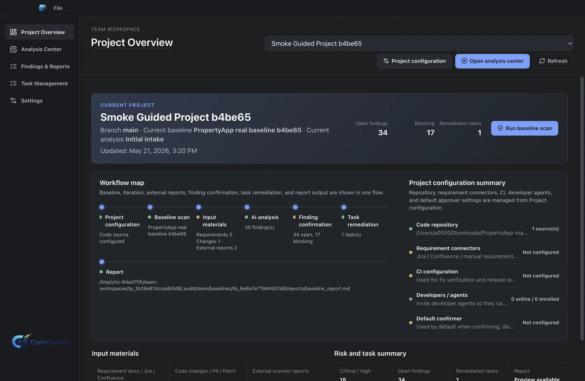
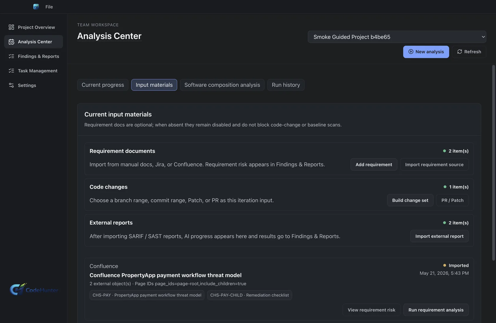
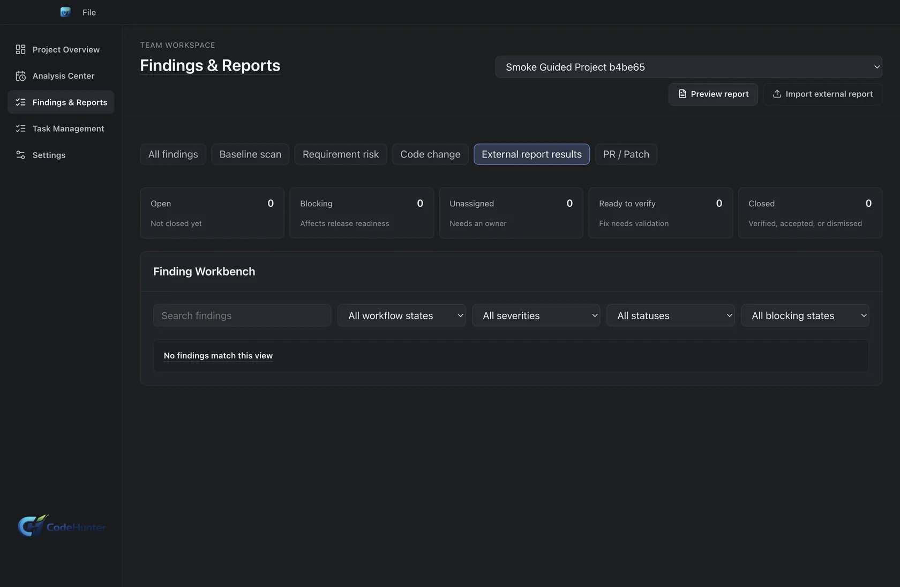
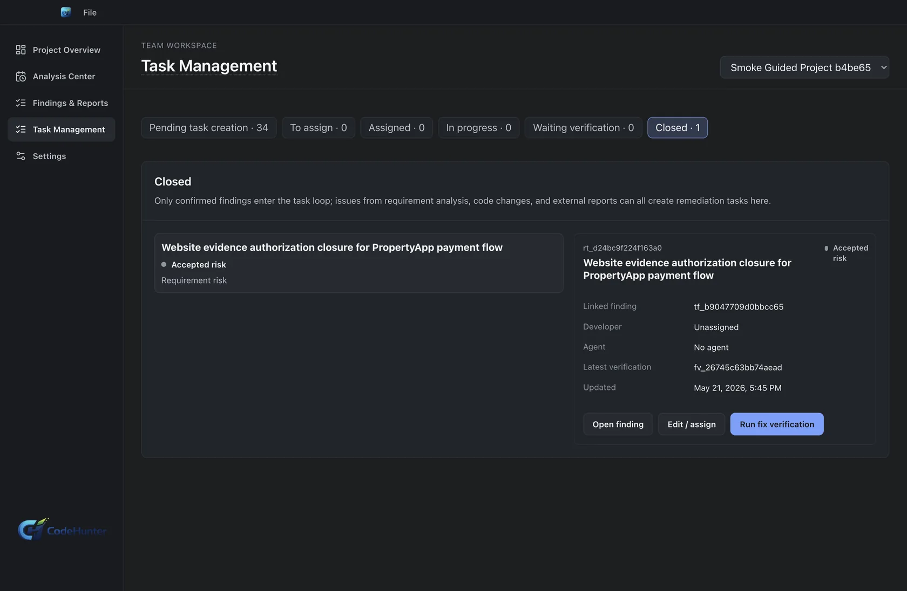

# Code Hunter Team Usage Tutorial

Use this tutorial when a team needs shared AppSec governance: projects, members, code sources, external scanner evidence, owner triage, remediation tasks, CI evidence, SCA governance, and release readiness.

## Before You Start

You need:

- Code Hunter Team installed and activated.
- Permission to create or manage a Team workspace.
- The project owner and release policy for the application or service.
- Access to the source repository or local source package.
- Any external SAST/SARIF/SCA reports you want to import.
- CI evidence or a plan for how CI results will be attached to remediation work.

Use one Team project for one product or service boundary. Do not group unrelated repositories only because they share an engineering owner.

## 1. Create A Team Workspace And Project

1. Open Code Hunter Team.
2. Create or select the Team workspace.
3. Add members who will manage security review, engineering ownership, or remediation.
4. Create a project.
5. Set project name, project owner, default branch, and release policy.
6. Confirm the project appears in Team Dashboard and Projects.

## 2. Configure Members And Roles

1. Add workspace members.
2. Assign roles based on responsibility:
   - Security reviewer for evidence review and triage.
   - Project owner for release decisions and accepted risk.
   - Developer or remediation owner for fix tasks.
3. Confirm each person can see the project and the workflow areas they need.

Keep ownership explicit. Team findings should not become anonymous alert lists.

## 3. Add A Code Source

Supported source patterns include:

- Local Git repository.
- Remote Git repository.
- Patch-only source.
- PR/MR review source.

For a remote repository:

1. Create an SCM profile.
2. Select GitHub, GitLab, or Bitbucket.
3. Select bearer token, basic auth, or SSH key.
4. Save the profile.
5. Create a code source using that profile.
6. Test the connection.
7. List refs and choose branch, tag, commit, or PR/MR.

A saved token is not enough. The code source is ready only when connection test, ref listing, baseline materialization, or PR review proves live source access.

## 4. Build Or Refresh The Baseline

The baseline is the security reference for the project.

1. Select the Team project.
2. Select the code source and ref.
3. Run baseline initialization.
4. Wait for the baseline workflow to finish.
5. Open the baseline report, findings, contracts, diff, and timeline.
6. Confirm the baseline represents the intended source state.

Do not promote a baseline from the wrong branch, stale commit, or temporary source copy.

## 5. Create An Iteration

An iteration represents a change cycle.

1. Create an iteration from the current baseline.
2. Attach requirement sources if the release has product or security requirements.
3. Attach code changes, patch material, or PR/MR review material.
4. Attach external scanner reports when available.
5. Confirm all input material belongs to the same project and iteration.

## 6. Import External SAST Or SARIF Reports

Use this when scanner output already exists.

1. Open the external report or SAST intake area.
2. Upload or select the report file.
3. Set scanner tool, format, project, branch, commit, and report date.
4. Preview the import.
5. Run external report analysis.
6. Review normalized findings.
7. Import only findings that should enter Team triage.

The goal is not to duplicate scanner output. The goal is to make scanner output attributable, reviewable, and actionable.

## 7. Run Requirement And Change Analysis

For a requirements-heavy release:

1. Run requirement extraction.
2. Run requirement impact analysis.
3. Run requirement security analysis.
4. Run owner review.
5. Run gate policy checks.

For a code-change or PR-focused release:

1. Run change impact.
2. Run delta generic risk.
3. Run delta business risk.
4. Run delta finding review.
5. Run owner finding triage.

Choose the path that matches the iteration input. Do not run stages only to produce more output.

## 8. Triage Findings And Assign Owners

Open the Findings workbench.

For each finding:

1. Confirm source, affected area, and product impact.
2. Read evidence and remediation direction.
3. Accept, reject, defer, or mark accepted risk.
4. Assign an owner when remediation is required.
5. Create a remediation task.
6. Add acceptance criteria so the developer knows what closes the task.

Do not send raw scanner rows to developers. Send owner-ready work with evidence, expected fix direction, and a done condition.

## 9. Remediate And Verify

1. The owner claims the remediation task.
2. The developer prepares a patch or PR/MR.
3. Link the PR/MR to the remediation task.
4. Run tests and CI.
5. Attach CI results, reviewer approval, or manual verification evidence.
6. Update finding status to verified fixed, accepted risk, or pending verification.

## 10. Review SCA Governance And Release Readiness

Use SCA governance when dependency risk affects the release.

1. Review dependency findings and policy state.
2. Confirm blocking dependencies.
3. Record exceptions only with owner rationale.
4. Attach remediation or verification evidence.
5. Run release readiness.

Release readiness evaluates:

- Blocking findings.
- Remediation task status.
- PR/MR and CI evidence.
- Fix verification.
- Accepted residual risk.
- Policy state.
- Owner approval.

Possible outcomes:

- **Blocked**: release cannot pass current policy.
- **Pending verification**: remediation exists but evidence is incomplete.
- **Pass with risk**: the owner accepts residual risk with rationale.
- **Ready**: policy, evidence, and verification are sufficient.

## 11. Promote A Fresh Baseline

After a release is accepted:

1. Promote the accepted state to a fresh baseline.
2. Confirm the new baseline has the correct parent and head commit.
3. Use the new baseline for the next iteration.

This prevents the next release from comparing against stale security state.

## Done Criteria

The Team workflow is complete when:

- The project and source scope match the intended product or service.
- Findings are reviewed, not raw scanner rows.
- Remediation tasks have owners, evidence, and acceptance criteria.
- Release readiness uses the same project, iteration, and source scope.
- Accepted risk is explicit and owner-approved.
- A fresh baseline is promoted only after the release decision is defensible.

## Troubleshooting

- If a code source cannot list refs, verify the SCM profile and network access.
- If imported findings lack ownership, review project mapping and scanner metadata.
- If release readiness is blocked, inspect blocking findings, task status, and missing CI evidence.
- If SCA policy is too noisy, review policy thresholds and exception rationale instead of bypassing the gate.
- If a baseline points to the wrong source, do not continue; rebuild it from the intended ref.
